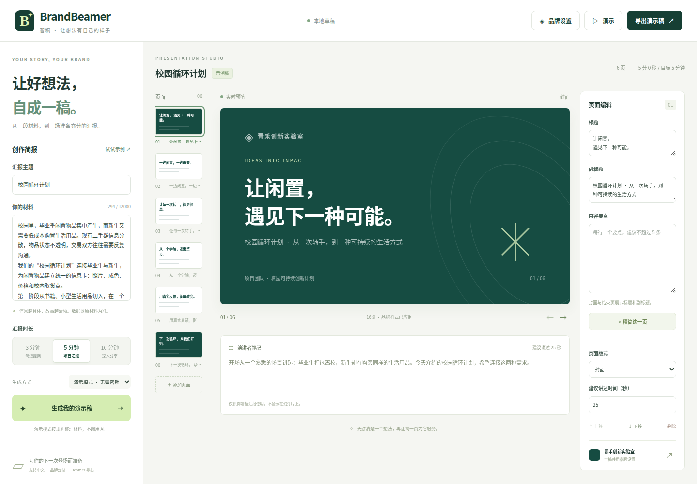

# BrandBeamer · 智稿

**让好想法，自成一稿。** 把汇报材料变成可编辑、符合机构品牌、适合指定讲述时长的演示稿。

BrandBeamer 是基于 [cityu-beamer](https://github.com/inscripoem/cityu-beamer) 改造的轻量演示稿工作台，适合学校项目汇报、实验室分享和企业内部提案。网页编辑器与 Beamer 导出共用结构化内容。



> **当前默认是无需密钥的规则演示模式。** 它按输入材料提取和组织内容，不调用 AI，也不会冒充 AI 输出。可在「AI 设置」中选择网站提供的模型，或填写 / 导入自己的 API 配置，再进行真实 AI 生成和单页精简。模型质量取决于所配置的服务与模型。

## 三步运行

需要 **Node.js 24 或更新版本**。无第三方运行依赖，无需安装包或构建。

```bash
git clone https://github.com/Theoic123/BrandBeamer.git
cd BrandBeamer
npm start
```

浏览器打开 **http://127.0.0.1:3000**。首次打开自带可编辑的中文示例稿。

## 已实现

- 输入汇报材料与主题，选择 3、5 或 10 分钟。
- 明确区分规则演示模式与真实 AI 模式。
- PNG/JPG Logo 上传（最大 2 MB）、机构、部门、汇报人和主题色定制，全稿同步应用。
- 根据 Logo 在浏览器内提取候选颜色，并推荐「品牌表达 / 简约留白 / 经典报告」风格；配色与风格可独立选择，浅色品牌自动使用清晰的文字颜色。推荐依据颜色特征，不调用 AI，也不会识别机构或品牌含义。
- 封面、要点、双栏、结束页四种版式，16:9 实时预览。
- 逐页编辑标题、副标题、要点、讲稿和建议讲述秒数。
- 单页精简、页面添加、删除、上下移动。
- 全屏幕覆盖式演示，方向键、空格和 Esc 控制。
- 浏览器打印 / 保存 PDF；Beamer `.tex`、主题、Logo 和许可证 ZIP 下载。
- JSON 草稿导出与导入，浏览器本地自动保存。
- 桌面和手机响应式布局，不加载第三方字体或分析脚本。

## 使用流程

1. 点击 **试试示例**，或粘贴自己的材料（30–12000 字）。
2. 选择汇报时长，保持 **演示模式**，点击 **生成我的演示稿**。
3. 在 **品牌设置** 中上传 Logo、修改机构名称和主色。仓库的 `public/demo/qinghe-logo.png` 是可用于试用的自制 Logo，青禾机构名称为虚构示例。
   上传后可点击提取出的颜色，选择 **采用推荐组合**，或从三张风格卡片中自行搭配。封面会实时预览；点击应用才会修改整份稿件，关闭弹窗则保留原设置。风格随 JSON 草稿保存，并应用于预览、打印和 Beamer 导出。
4. 从左侧页面列表选页，在右侧修改内容；讲稿位于画布下方。
5. 点击 **演示** 翻页，或通过 **导出演示稿** 保存 PDF、Beamer 源码和 JSON 草稿。

生成会替换当前演示稿。重要版本建议先导出 JSON 草稿；品牌信息独立于内容保存。

## 接入 AI

点击生成方式附近的 **AI 设置**，选择以下一种来源：

- **网站提供**：选择管理员已配置的模型。网站密钥只保存在服务器中，不会返回浏览器。未配置的模型会明确标注。
- **我的 API**：选择 OpenAI、Claude、Qwen、Gemini 或 OpenAI 兼容服务，填写 API Key、模型 ID 和 API Base URL。也可以从 JSON 文件导入配置，检查后再应用。

OpenAI / Qwen / 兼容服务使用 Chat Completions；Claude 使用 Messages；Gemini 使用原生 generateContent。模型输入框允许填写服务商实际支持的模型 ID，预设列表不代表你的账户已开通对应模型。

用户常说的「ChatGPT 5.4」在 OpenAI API 中对应 `gpt-5.4`，见 [官方模型文档](https://developers.openai.com/api/docs/models/gpt-5.4)。Qwen 的接口地址与工作空间 / 区域有关，请从自己的控制台复制 Base URL；中转平台则选择它实际提供的协议和模型 ID。

**测试连接**会发送一次少量文本请求，可能产生 API 费用。连接成功后点击应用，再选择 AI 生成。测试不会替换当前演示稿。生成和单页精简使用同一份已应用配置；接口失败不会自动切换为演示模式。

### 网站管理员配置

复制 `.env.example` 为 `.env`（PowerShell：`Copy-Item .env.example .env`）。按需填写 `OPENAI_API_KEY`、`ANTHROPIC_API_KEY`、`QWEN_API_KEY`、`GEMINI_API_KEY`，以及对应的 `_MODEL` / `_BASE_URL`。所有配置项和默认值见 [.env.example](.env.example)。保存后重启 Node 服务。

旧的 `AI_API_KEY` / `AI_BASE_URL` / `AI_MODEL` 仍作为默认兼容接口配置使用。无需一次配置所有服务；只配置你准备使用的服务即可。

### 个人配置文件

可导入以下形状的 UTF-8 JSON 文件，最大 16 KB：

```json
{
  "provider": "compatible",
  "baseUrl": "https://your-provider.example/v1",
  "model": "your-model-id",
  "apiKey": "your-api-key"
}
```

`provider` 支持 `openai`、`anthropic`、`qwen`、`gemini`、`compatible`。导入只填充设置，不会立即调用模型。个人接口需要使用公网 HTTPS 地址，不支持 localhost、局域网地址或自动跳转。

个人密钥只保留在当前页面内存中，刷新后需要重新填写；不进入 localStorage、演示稿 JSON 或 Beamer 导出。调用时配置会经本网站服务器转发给你选定的服务商，因此请只在你信任的 BrandBeamer 部署上输入密钥。含密钥的配置文件请自行妥善保管，不要提交到 Git；`.env` 已被忽略且不会由静态服务器提供。

Logo 不发送给模型，生成只发送材料和必要的品牌文本。模型返回需经结构与长度校验，讲述秒数会调整至目标总时长。正式使用前仍需核对内容事实。

## PDF 与 Beamer

**浏览器 PDF**：选择“打印 / 保存为 PDF”，在浏览器打印界面保存。模板设置为 320 × 180 mm、每张幻灯片一页。建议关闭浏览器页眉页脚并启用背景图形；若浏览器不采用自定义纸张，请选择横向、零边距并检查预览。

**Beamer**：解压 ZIP 后，用带有 `beamer`、`ctex`、Fandol、`fontspec`、TikZ、Latin Modern 和 TeX Gyre 字体的 XeLaTeX 环境编译。具体命令见 ZIP 内的 README。文本中的 LaTeX 特殊字符会转义，用户输入不会作为原始 LaTeX 命令执行。

网页和 Beamer 使用两种排版引擎，导出内容一致，视觉布局不保证像素级相同。Beamer 保留了上游封面与结束页不计入正文页码的惯例。中文、英文、特殊字符、空列表与单条双栏测试稿已在 GitHub Actions 使用 XeLaTeX 连续编译两次通过；本机使用源码导出仍需自行安装 TeX 环境。

## 验证

```bash
npm run check
npm test
```

自动化测试使用 Node 内置测试框架，并关闭测试进程隔离以兼容受限 Windows 环境。覆盖请求校验、演示生成、模拟 AI 上游、错误处理、静态文件边界、ZIP 结构与 CRC、Logo 配色提取、颜色对比度、风格白名单及 LaTeX 转义。CI 另外运行浏览器流程测试与三种风格的 XeLaTeX 编译，并保留截图、PDF 和导出包作为测试产物。真实付费模型调用不属于离线测试。

首版完整验证记录：[GitHub Actions](https://github.com/Theoic123/BrandBeamer/actions/runs/34681801193)。三项任务（Node 测试、浏览器流程、Beamer 编译）均通过。浏览器测试还检查打印页面的要点和页脚没有超出画布。

## 项目结构

```text
server.mjs                 Node HTTP 服务、AI/演示生成、校验
ai-service.mjs             多模型协议、配置与上游请求
public/index.html          工作台结构
public/styles.css          品牌预览、响应式与打印样式
public/app.js              编辑状态、交互、草稿和演示
public/ai-settings.js       网站 / 个人 AI 设置与连接测试
public/export.js           Beamer 源码与无依赖 ZIP 打包
templates/beamer/          通用品牌主题与上游许可证
tests/                     Node 自动化测试
docs/DEMO.md               比赛演示脚本与验收清单
```

## 范围与后续计划

此版本适合本地使用与 hackathon 演示：无账号、多租户隔离、数据库或协作服务。草稿及 Logo 存在当前浏览器 localStorage；清除站点数据会清除草稿。建议通过 JSON 导出保存重要版本。

默认仅监听本机。若将 `HOST` 改为 `0.0.0.0` 对外提供服务，应在部署入口增加认证和调用限额，避免公开消耗模型额度。GitHub 仓库提供源码；它本身不是运行 Node 服务的网站托管。

下一阶段：配置真实模型并用真实材料评估、进一步优化长内容排版。随后再考虑文档解析、PPTX 和协作。

## 开源与致谢

本项目使用 MIT 许可证。Beamer 主题改造自 `inscripoem/cityu-beamer` 的 MIT 代码，保留上游版权声明，详见 [THIRD_PARTY_NOTICES.md](THIRD_PARTY_NOTICES.md)。公开项目未附带上游 CityU 校徽、背景图、含品牌素材的 PDF 或预览。通用网页背景与主题图形为本项目实现；上传素材由使用者自行确保有权使用。本项目与 CityU 或示例机构无官方关联。
